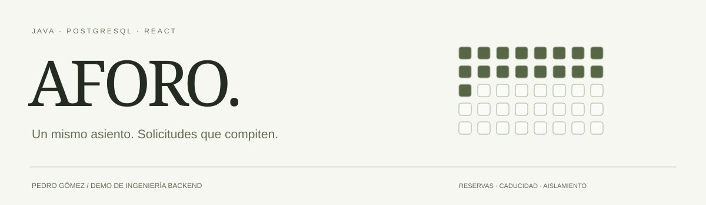
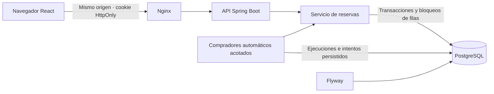

<div align="center">



# AFORO

**Selecciona un asiento. Lanza compradores. Comprueba quién consigue reservar.**

[](https://github.com/CODIGOAFRX/AFORO/actions/workflows/backend.yml)


[Arranque local](#arranque-en-un-comando) · [Decisiones técnicas](docs/architecture.md) · [API](docs/openapi.yaml) · [Pruebas](#qué-se-comprueba) · [Portfolio](https://www.pedrogomez.dev/)

</div>

> **Cloudflare:** hay una segunda implementación para Workers + D1, probada en local en el puerto 8787. Mantiene las reglas de reserva mediante control optimista de revisiones. La versión Java/PostgreSQL sigue siendo el backend de referencia en Docker (8088). El despliegue público permanece desactivado: los límites operativos implementados no garantizan un tope de facturación del 10 % en Workers Paid. [Arquitectura, presupuesto y arranque D1](docs/cloudflare.md).

## Qué es

AFORO es una demo de reservas para un concierto con 60 asientos numerados. Puedes
reservar tú, competir desde dos pestañas o lanzar hasta 30 compradores automáticos
que ocupan el mismo plano. Cada resultado procede del backend y queda en PostgreSQL.

El problema central es sencillo de explicar: **dos solicitudes pueden ver libre
el mismo asiento, pero no deben conseguir dos reservas vigentes sobre él**.

> **Estado:** demo local funcional, en desarrollo. El concierto y los precios son
> ficticios. Compra simulada y entradas QR pendientes. Todavía no hay URL pública
> de la aplicación; el portfolio es un proyecto independiente.

## Pruébalo en dos minutos

1. Selecciona asientos y confirma una reserva temporal de cinco minutos.
2. Lanza compradores: de 1 a 30, cada 1, 2 o 5 segundos, con uno o dos asientos juntos.
3. Observa los asientos ocupados, las reservas totales y la actividad de cada comprador.
4. Abre la demo en otra pestaña: comparte inventario y tus reservas. Intenta reservar
   el mismo asiento en ambas antes de que llegue la actualización.
5. Recarga: las reservas y la ejecución se recuperan del servidor.

**Tus reservas** y las **automáticas** se muestran por separado. Una ventana privada
obtiene su propio inventario. Al caducar, los asientos vuelven a estar disponibles.

La prueba automática genera llegadas espaciadas; no se anuncia como 30 usuarios
simultáneos ni como benchmark. La interfaz consulta cambios cada segundo.

## Arranque en un comando

Necesitas Git y Docker con Compose. Desde cualquier carpeta:

```sh
git clone https://github.com/CODIGOAFRX/AFORO.git
cd AFORO
docker compose up -d --build --wait
```

Abre **http://localhost:8088**. La primera ejecución descarga y construye imágenes.
En Windows también puedes usar `start-aforo.cmd`; `stop-aforo.cmd` detiene la demo.

| Servicio | Responsabilidad | Acceso local |
| --- | --- | --- |
| web | React/TypeScript servido por Nginx | localhost:8088 |
| backend | API Spring Boot y ejecución de compradores | Red interna Docker |
| postgres | Inventario, reservas, experimentos y migraciones | localhost:54330 |

Los datos persisten en un volumen. Los puertos publicados escuchan solo en localhost.
Las credenciales de Compose son ejemplos de desarrollo, nunca de producción.

```sh
docker compose stop                      # Detener y conservar datos
docker compose ps                        # Estado de los servicios
docker compose logs --tail=80 backend     # Diagnóstico
```

## Ingeniería que se puede revisar



| Decisión | Qué evita | Dónde revisarla |
| --- | --- | --- |
| Bloquear asientos en orden estable y volver a leer su disponibilidad | Reservas incompatibles y decisiones con datos anteriores a una espera | [InventoryService](backend/src/main/java/dev/pedrogomez/aforo/InventoryService.java) |
| Confirmar todos los asientos en una transacción | Reservas parciales de un grupo | [Pruebas HTTP y PostgreSQL](backend/src/test/java/dev/pedrogomez/aforo/ReservationIntegrationTest.java) |
| Comprobar vencimiento con el reloj de PostgreSQL tras obtener bloqueos | Depender del reloj del navegador o del limpiador | [Decisión transaccional](docs/architecture.md) |
| Cookie aleatoria; solo su hash en base de datos | Usar un UUID público como credencial | [Sesiones y acceso](docs/architecture.md#sesiones-y-acceso) |
| Ejecución persistida, límites de admisión y una reserva por comprador | Duplicar intentos al reiniciar o ejecutar desde varias instancias | [Experimentos](docs/experiments.md) |
| Resultado y reserva en la misma transacción | Mostrar compras o reservas automáticas que no se guardaron | [ExperimentRunner](backend/src/main/java/dev/pedrogomez/aforo/ExperimentRunner.java) |

JDBC permite revisar el SQL directamente. No hay Redis, Kafka, microservicios ni
bloqueos en memoria usados como única protección de inventario.

## Qué se comprueba

Las pruebas arrancan **PostgreSQL real con Testcontainers** y llaman a la API HTTP:

- Dos solicitudes por un asiento: una reserva y un conflicto.
- Grupos solapados: todos los asientos o ninguno.
- Reservas vencidas recuperables sin limpiador.
- Aislamiento de sesiones y recuperación exclusiva de reservas propias.
- Entrada inválida, cookies falsas/caducadas y origen ajeno.
- Treinta compradores con dos asientos: 60 retenidos, sin aparecer en tus reservas.
- Límites, ritmo, detención y acceso a experimentos ajenos.
- Parejas contiguas que no cruzan filas y falta de disponibilidad explícita.

En los casos concurrentes, una tercera conexión retiene temporalmente el asiento.
La prueba observa **dos solicitudes esperando bloqueos en PostgreSQL**, libera el
bloqueo y comprueba las respuestas y lo persistido. No depende de que dos hilos
arranquen aproximadamente a la vez.

```sh
mvn -B -f backend/pom.xml verify
cd frontend
npm ci
npm run build
```

Para desarrollo fuera de los contenedores: Java 21, Maven y Node 24. `npm run dev`
usa la API de la demo Docker. [Registro y límites de las verificaciones](docs/verification.md).

## Estructura

```text
backend/                 API, dominio, migraciones y pruebas PostgreSQL
frontend/                React, plano accesible y actividad de compradores
.github/workflows/       Verificación y publicación de imágenes
scripts/                 Alternativa PostgreSQL nativa para Windows
docs/                    Decisiones, contrato y operación
compose.yaml             Entorno local completo
```

## GitHub → despliegue

Cada cambio en `main` ejecuta CI. Si las comprobaciones pasan, se publican las
imágenes del backend y frontend en GHCR, etiquetadas con el SHA del commit.

La conexión a producción **todavía no está activada**. Cloudflare puede servir
la aplicación bajo un subdominio o una ruta, pero falta configurar el destino
Java y PostgreSQL persistente. [Plan concreto de despliegue](docs/deployment.md).
El portfolio solo necesitará un enlace estable; no habrá que copiar la app dentro
de su repositorio cada vez que cambie.

## Siguiente trabajo

- [x] Reservas atómicas, caducidad y aislamiento.
- [x] Demo navegable, recuperación y actualización del plano.
- [x] Compradores automáticos con resultados persistidos y límites.
- [ ] Compra simulada con idempotencia y pruebas de compra frente a caducidad.
- [ ] Entradas QR y validación de un solo uso.
- [ ] SSE, limpieza y límites públicos de toda la API.
- [ ] Despliegue, monitorización y pruebas con usuarios.

## Autoría y uso de IA

Proyecto de [Pedro Gómez](https://www.pedrogomez.dev/), construido con asistencia
 de IA. Las pruebas y limitaciones están documentadas; no se atribuyen revisiones
humanas que aún no se han realizado. La intención es que las decisiones puedan
explicarse y comprobarse leyendo el código, no presentar la velocidad de generación
como evidencia de calidad.
